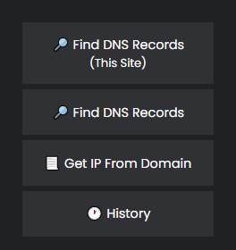
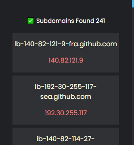
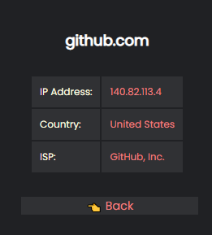

<h3 align="center">DNSTool - Chrome Extension</h3>

    

A Chrome extension that allows users to quickly look up DNS records, IP addresses, and save them for future reference, for any given domain.

## Info
I created this extension as a fun and educational project while learning to develop Chrome Extension. This is also my first attempt at creating a Chrome extension and though it was written in a short amount of time, I am proud of what I was able to accomplish. However, since it was a learning experience, you may encounter some bugs or errors. Additionally, the code may not be as organized or commented as it could be, but I am keeping it as a reference for future projects 😅. 
`Uses the HackerTarget Hostsearch API`
## How to install
To install the extension, download the repository, extract it to a secure location and open Google Chrome, then navigate to the Extensions tab (ensuring Developer mode is enabled) and select "Load Unpacked" . Now, choose the 'src' folder from the location where you extracted the repository and the extension will be installed.

This extension should work on any Chromium based browsers (Hopefully..)

## Screenshots
**\*Tested on Brave Browser**

  
  
  
  

